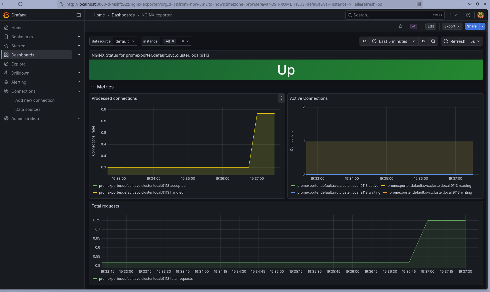

# nginx Monitoring on Kubernetes

A self-contained observability stack for an nginx workload on a local
[Kind](https://kind.sigs.k8s.io/) cluster: nginx exposes `stub_status` metrics,
[nginx-prometheus-exporter](https://github.com/nginxinc/nginx-prometheus-exporter)
translates them to Prometheus format, **Prometheus** scrapes them, and
**Grafana** renders a pre-provisioned dashboard, all installed via Helm and
brought up with one idempotent script. A slowloris load test then shows the
attack signature live in the dashboard.

```
host (Docker)
└── Kind cluster "nginx-monitoring"
    ├── default ns
    │     ├── Deployment nginx            (custom nginx.conf + index.html)
    │     ├── Service    nginx            NodePort 80→30080, 8080→30088
    │     ├── Deployment nginx-prometheus-exporter
    │     └── Service    promexporter     ClusterIP :9113
    └── monitoring ns
          ├── Helm release prometheus     (scrapes promexporter:9113)
          └── Helm release grafana        (datasource = prometheus-server,
                                           dashboard gnetId 12708)
```

The site is on host port `30080`; the nginx `/metrics` (stub_status) endpoint is
on `30088`, deliberately on a **separate port** so the public site never exposes
connection counts.



## Quickstart

Prerequisites: Docker, `kubectl`, `kind`, `helm` (and `slowhttptest` for the load
test). Then:

```bash
bash scripts/setup.sh    # create the cluster and deploy everything (idempotent)
bash scripts/verify.sh   # automated checks for nginx / exporter / Prometheus / Grafana
```

A passing verify run ends with `All automated checks passed.`

### Access the UIs

```bash
# Prometheus
kubectl -n monitoring port-forward svc/prometheus-server 9090:80   # http://localhost:9090

# Grafana
kubectl -n monitoring port-forward svc/grafana 3000:80             # http://localhost:3000
kubectl -n monitoring get secret grafana \
  -o jsonpath='{.data.admin-password}' | base64 -d ; echo          # admin password (user: admin)
```

The **NGINX Prometheus Exporter** dashboard (gnetId 12708) is provisioned
automatically. The application endpoints are reachable on the host directly,
no port-forward needed:

```bash
curl http://localhost:30080/           # the HTML site
curl http://localhost:30088/metrics    # stub_status
```

### Load test

With the Grafana dashboard open (auto-refresh 5s):

```bash
bash scripts/dos-test.sh
```

It runs a 240s slowloris attack against `:30080` and writes a slowhttptest report
into `reports/`. `slowhttptest` printing `Connection refused` once nginx runs out
of worker connections is the success signal, not an error; nginx recovers on its
own within a few seconds of the attack stopping. What the metrics do during the
run, and how you'd actually defend against it, is written up in
[`docs/dos-and-hardening.md`](docs/dos-and-hardening.md).

## Teardown

```bash
kind delete cluster --name nginx-monitoring
```

## Design notes

- **Bring-up is declarative and idempotent.** `setup.sh` skips cluster creation
  if it already exists and uses `helm upgrade --install`, so re-running it is
  safe. All Kubernetes state lives in numbered manifests applied in order.
- **Cross-namespace scrape by FQDN.** Prometheus (in `monitoring`) reaches the
  exporter (in `default`) via `promexporter.default.svc.cluster.local:9113`,
  configured through `extraScrapeConfigs` in the Prometheus Helm values.
- **No hardcoded Grafana password.** The chart generates a random admin password
  into the `grafana` Secret; retrieve it with the command above.
- **Metrics isolation.** nginx serves the site on `:80` and `stub_status` on a
  separate `:8080` server block that 404s everything except `/metrics`.

## Documentation

- [`docs/implementation.md`](docs/implementation.md): how each component is built.
- [`docs/verification.md`](docs/verification.md): how to verify each one, by hand.
- [`docs/dos-and-hardening.md`](docs/dos-and-hardening.md): the slowloris
  observation and a layered hardening proposal.

## License

GPL-3.0. See [LICENSE](LICENSE).
