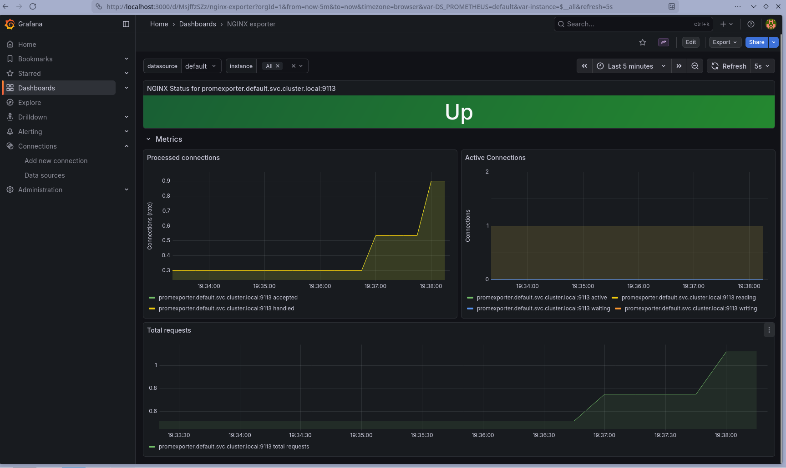

# Slowloris observation & hardening proposal

This stack is small on purpose, so it makes a good target for showing what a
slow-HTTP (slowloris) attack looks like through the metrics — and what you would
add to actually defend against it.

## The load test

- **Tool:** [`slowhttptest`](https://github.com/shekyan/slowhttptest), slow-headers mode.
- **Target:** `http://localhost:30080/` — the NodePort serving the HTML site.
- **Driver:** [`scripts/dos-test.sh`](../scripts/dos-test.sh), which runs:

  ```bash
  slowhttptest -c 1000 -H -g -o reports/slowhttptest-<ts> \
    -i 10 -r 200 -t GET -u http://localhost:30080/ \
    -x 24 -p 3 -l 240
  ```

  1000 connections, each dripping request headers slowly so the socket never
  completes, held for 240 seconds.

## What the dashboard shows



Reading the `stub_status`-derived panels during the run:

- **`nginx_connections_active`** climbs steeply toward `worker_connections`
  (1024) and stays pinned there for the duration. The slow-headers technique
  holds TCP sockets open without ever finishing a request, so each one counts as
  active.
- **`nginx_connections_reading`** goes from ≈0 to several hundred — slowhttptest
  is drip-feeding the request line and headers, so most sockets sit in the
  *reading* state.
- **`rate(nginx_connections_accepted[1m])`** spikes at the start as new sockets
  are opened, then plateaus — the attacker is *holding* sockets, not opening new
  ones at a high rate.
- **`rate(nginx_connections_handled[1m])`** tracks the accepted rate before and
  after the attack but diverges during it (handled grows far more slowly),
  meaning connections are being dropped or closed without being served.
  slowhttptest itself reports `service available: NO` and exits with
  `Connection refused` once nginx runs out of worker connections — that is the
  successful-DoS signal, not a script error.
- **Recovery:** after the attack stops, `active` returns to ≈1–2 within a minute
  as workers reap the slow sockets, and the rate panels flatten to baseline.

**Conclusion.** `stub_status` + Prometheus is enough to *detect* a
slowloris-class attack: a saturated active/reading count plus a divergence
between the accepted and handled rates is an unambiguous signature. It is not
enough on its own to *mitigate* the attack — that needs the controls below.

## Hardening

What I would add to this nginx + Prometheus + Grafana setup, grouped by layer.

### Network exposure
- **Remove the NodePort on `:30088`.** The metrics endpoint should not be public
  — it leaks active-connection counts, which tell an attacker whether their DoS
  is landing. Reach it only via in-cluster traffic from the exporter.
- **Front `:30080` with an ingress controller + TLS** (cert-manager /
  Let's Encrypt). Terminate HTTPS at the ingress and force HSTS.
- **NetworkPolicies** in `default` and `monitoring`:
  - `default`: only the exporter pod may reach `nginx:8080`; everything else may
    only reach `:80`.
  - `monitoring`: Prometheus may egress to `promexporter.default:9113` only;
    Grafana may egress to `prometheus-server` only.
  - Deny-all ingress on the metrics port (8080) by default.

### Application (nginx)
- **Rate- and connection-limit** the public server block: `limit_req_zone`
  (e.g. 10 r/s per IP) and `limit_conn_zone`.
- **Lower the timeouts** — `client_body_timeout`, `client_header_timeout`,
  `keepalive_timeout`, `send_timeout`. This directly counters slowloris: a slow
  client gets dropped before it can hold a worker hostage.
- **Reduce the attack surface**: `server_tokens off;`, drop unused HTTP methods,
  add security headers (CSP, X-Content-Type-Options, Referrer-Policy,
  X-Frame-Options).
- **Lock down the container**: read-only root filesystem, `runAsNonRoot: true`
  / `runAsUser: 101`, drop all capabilities, `seccompProfile: RuntimeDefault`.
- **Set CPU/memory requests and limits** so a saturated nginx can't starve the
  node, and tune `worker_connections` to match those limits.

### Kubernetes platform
- Each component under its own ServiceAccount with minimal RBAC.
- Pod Security Admission at the `restricted` level for `default` and
  `monitoring`.
- Pin images by digest (`@sha256:…`), not floating tags; scan them with Trivy or
  Grype in CI and reject on Critical/High CVEs.
- Enforce policy with Kyverno / OPA Gatekeeper: no `:latest`, no privileged
  containers, must drop `NET_RAW`, must set resource limits.
- Add Falco (or Tetragon) for runtime detection of unexpected exec/network
  behaviour in the nginx pod.

### AuthN / AuthZ for the observability stack
- **Grafana:** the chart already generates a random admin password into a Secret
  (this repo relies on that rather than hardcoding one). Beyond that, enable
  OIDC against an identity provider and keep anonymous access off.
- **Prometheus UI** is unauthenticated — gate it behind the ingress with basic
  auth or oauth2-proxy. Same for Alertmanager once it's added.
- Use Sealed Secrets or the External Secrets Operator for any credential that
  lands in Git.

### Observability & response
- Add Alertmanager with rules that mirror the signals above:
  - `rate(nginx_connections_accepted[1m]) - rate(nginx_connections_handled[1m]) > N`
  - `nginx_connections_active > 0.8 * worker_connections`
  - exporter target down for > 2 minutes
- Pipe alerts to email/Slack with a runbook link.
- Enable Kubernetes audit logging at the cluster level.

### Defence-in-depth against DoS specifically
- Put a CDN / WAF (Cloudflare, ModSecurity) in front of the cluster for
  built-in rate-limiting and bot detection.
- Tune the node kernel: `net.ipv4.tcp_syncookies=1`, lower
  `net.ipv4.tcp_max_syn_backlog`, enable `tcp_tw_reuse`.
- Run nginx with an HPA so legitimate spikes scale capacity while the
  rate-limiter discards abuse.
